<div align="center" padding=25px>
    
</div>

# Supercharge Customer Onboarding with Event-Driven Microservices and Confluent Cloud
In today's fast-paced digital landscape, organizations from various industries are harnessing technology to deliver exceptional customer experiences. Among the critical touchpoints in this journey, the 'Customer Onboarding' process stands out. Often viewed as time-consuming and complex, customer onboarding represents a prime opportunity for digital transformation. This demonstration showcases the advantages of leveraging Confluent Cloud for customer onboarding and offers insights into how it empowers businesses to accomplish their objectives.

# Overview
This demo illustrates the data ingestion process during user signup and the subsequent production of user details and events into Confluent Cloud topics. The user data gathered from these topics will be enriched and synchronized with the Postgres database using a Postgres sink connector. The primary objective is to capture user details and facilitate account creation and login actions using Kafka-based event-driven microservices.

# Architecture Diagram

At the core of the modernized customer onboarding system for financial services organizations lies Confluent Cloud, enabling real-time event streaming and processing. This dynamic infrastructure relies on Kafka as its backbone, seamlessly connecting a suite of specialized microservices. Below is an overview of their orchestrated workflow:

<div align="center"> 
  
</div>

The streaming architecture, powered by Confluent Cloud, offers an agile, responsive, and customer-centric onboarding process. With Kafka as the central component, each microservice operates independently yet stays seamlessly synchronized, highlighting the capabilities of event-driven architectures.

<div align="center"> 
  
</div>

In this demonstration, we will explore the signup and login flows, utilizing React (frontend) and Java (backend) to interactively generate records and events. User and event details will be collected in dedicated topics, and the Postgres sink connector in Confluent Cloud will be employed to transfer the data into the database. Subsequently, when the login action is initiated, the user data will be retrieved to verify the account login.

> **Note:** Please note that this application is designed for interactive demo purposes and to illustrate real-world customer scenarios. It is not intended for production use.

# Prerequisites

To ensure a smooth and successful experience with this demo, please make sure you have the following tools and accounts set up:

- **Confluent Cloud Account**: You'll need a Confluent Cloud account. If you don't have one, you can sign up for a free trial [here](https://developer.hashicorp.com/terraform/tutorials/aws-get-started/install-cli).
    - After verifying your email address, access Confluent Cloud sign-in by navigating [here](https://confluent.cloud).
    - When provided with the _username_ and _password_ prompts, fill in your credentials.
    
    > **Note:** If you're logging in for the first time you will see a wizard that will walk you through the some tutorials. Minimize this as you will walk through these steps in this guide.

    - Create Confluent Cloud API keys by following the steps in UI.Click on the button that is present on the right top section and click on Cloud API Key.
    <div align="center"> 
        
    </div>  

    - Now Click Add Key to generate API keys and store it as we will be using that key in this demo.  
    > **Note:** This is different than Kafka cluster API keys. 

- **Terraform**: If you don't already have Terraform installed, you can find installation instructions [here](https://developer.hashicorp.com/terraform/tutorials/aws-get-started/install-cli).

- **Node.js**: You'll need Node.js installed on your system. You can download it from the official website [here](https://nodejs.org/en/download), or use your [system's package manager](https://nodejs.org/en/download/package-manager).

- **Java 17**: Ensure you have Java 17 installed. You can follow the installation instructions [here](https://www.oracle.com/in/java/technologies/downloads/#java17).

- **Postgres Database**: You'll need a Postgres database instance. You can provision one via [via aws](https://aws.amazon.com/getting-started/hands-on/create-connect-postgresql-db/), [via docker](https://www.commandprompt.com/education/how-to-create-a-postgresql-database-in-docker/), or any other method of your choice. Make sure it is accessible to Confluent Cloud and the Java client.

With these prerequisites in place, you'll be ready to explore and run the demo seamlessly.
  
# Setup
1. Clone the repository
    ```
    git clone https://github.com/sharang-ramana/Customer-Onboarding.git
    ```
2. This demo uses Terraform  to spin up resources that are needed.
    - Update the `terraform/variables.tf` file for the following variables with your Cloud API credentials.
        ```
            variable "confluent_cloud_api_key" {
              description = "Confluent Cloud API Key (also referred as Cloud API ID)"
              type        = string
              default = " "   #Add your API Key created during pre-requsite
            }
            
            variable "confluent_cloud_api_secret" {
              description = "Confluent Cloud API Secret"
              type        = string
              sensitive   = true
              default = " "   #Add your API secret created during pre-requsite
            }
            
            variable "postgres_host" {
              description = "Add your Postgres Host"
              type        = string
              default = " " #Add your postgres host here
            }
            
            variable "postgres_port" {
              description = "Add your Postgres port"
              type        = string
              default = " " #Add your postgres port here
            }
            
            variable "postgres_user" {
              description = "Add your Postgres user"
              type        = string
              default = " " #Add your postgres user here
            }
            
            variable "postgres_password" {
              description = "Add your Postgres password"
              type        = string
              sensitive   = true
              default = " " #Add your postgres password here
            }
            
            variable "postgres_db_name" {
              description = "Add your Postgres DB name"
              type        = string
              default = " " #Add your postgres database name here
            }
        ```
    ### Build your cloud infrastructure

    - Navigate to the repo's terraform directory.
        ```bash
        cd terraform
        ```

    - Initialize Terraform within the directory.
        ```
        terraform init
        ```

    - Preview the actions Terraform would take to modify your infrastructure or Check if there are any errors in the code.
        ```
        terraform plan
        ```

    - Apply the plan to create the infrastructure.

        ```
        terraform apply 
        ```

    - Get the credentials and other info which were automatically created by the terraform script, which will also be used later in this demo.
        ```
        terraform output resource-ids
        ```

    - Verify the Environment, Cluster, Schema Registry, KsqlDB, Topics and Connector created in the Confluent Cloud UI by terraform.

   > **Note:** Read the `main.tf` configuration file [to see what will be created](./terraform/main.tf).

3. Run the React application
    ```bash
    cd Frontend
    npm install
    npm start
    ```
    The website is now live. You can view it by opening this link in your browser tab [http://localhost:3000/](http://localhost:3000/)

4. Run the Java Backend
    - Add the postgres credentials to the **application.properties** present in this path `Backend/src/main/resources/`
    - Add the Kafka and Schema Registry credentials created via `terraform output resource-ids` to the **client.properties** present in `Backend/src/main/resources/`
    - Run the below commands
        ```bash
        cd Backend
        mvn spring-boot:run
        ```
        Now the Backend should be exposed via `8080` port `http://localhost:8080/` and also the empty `customer` and `customer_enriched` table will be created in the postgres database with necessary columns.

# Demo

1. **Signup Process:**  
    Open your web browser and go to `http://localhost:3000/`. This will take you to the signup screen.
    <div align="center"> 
        
    </div>

2. **Event Tracking:**  
    At each step of the signup form, take note that an event is produced to the `events` topic in Confluent Cloud. The record key for each event is your email ID, which you entered on the signup page.  
    **Step 1:**
    <div align="center"> 
        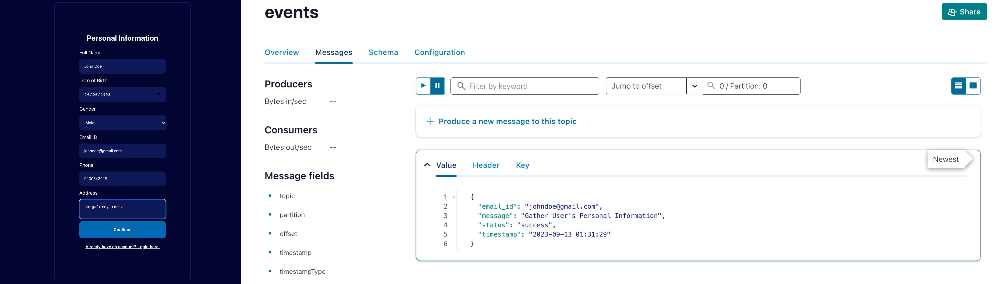
    </div>

    **Step 2:**
    <div align="center"> 
        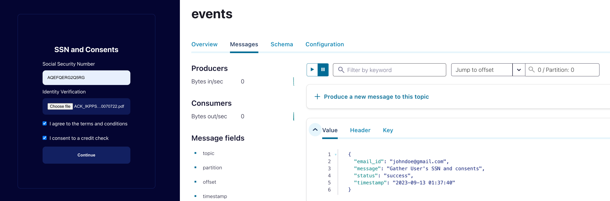
    </div>

    After submitting your SSN and consents, you will observe the identity and credit checks being conducted. While the credit check verification is in progress, you will be able to view the user's credit score (simulated implementation of Credit Bureau) being sent to a `credit_score` topic.
    <div align="center"> 
        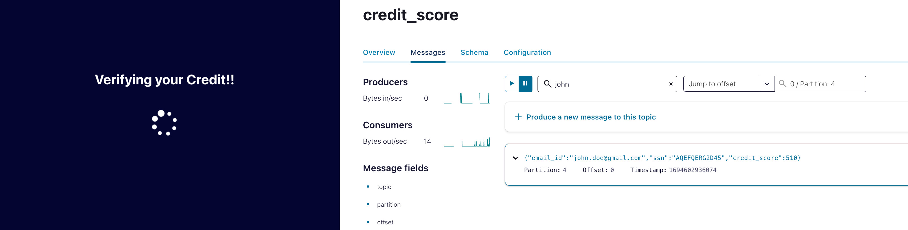
    </div>

    **Step 3:**
    <div align="center"> 
        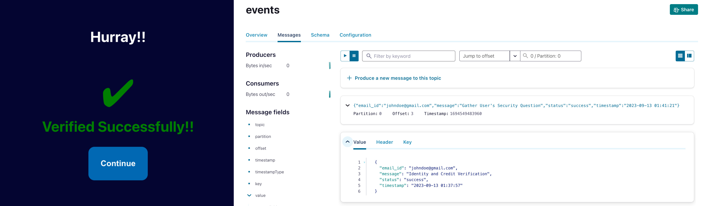
    </div>

    **Step 4:**
    <div align="center"> 
        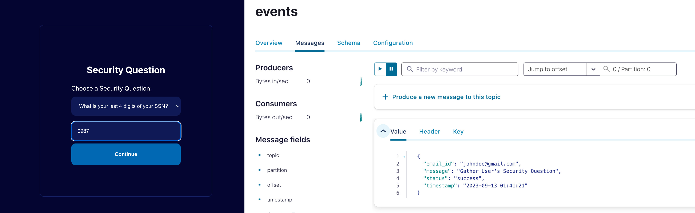
    </div>

    **Step 5:**
    <div align="center"> 
        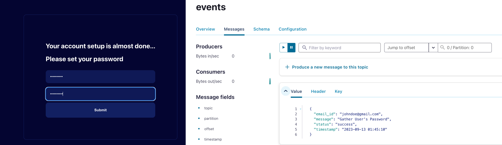
    </div>

    **Step 6:**
    <div align="center"> 
        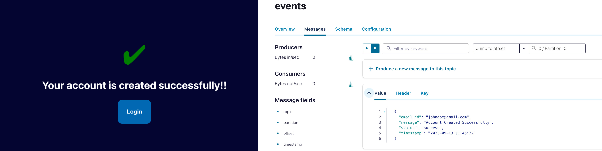
    </div>

3. **Customer Data Recording:**  
    On the final step of the signup process, you'll notice that a record containing the user details you entered is added to the `customer` topic in Confluent Cloud. Once again, the record key is your email ID.
    <div align="center"> 
        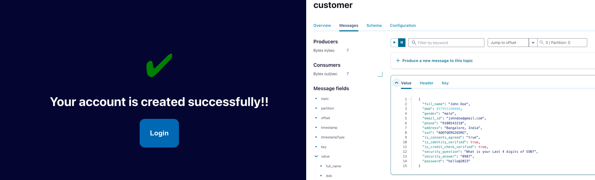
    </div>

4. **Data Streams with ksqlDB:**  
    Now that you have data flowing through Confluent, you can now easily build stream processing applications using ksqlDB. You are able to continuously transform, enrich, join, and aggregate your data using simple SQL syntax. You can gain value from your data directly from Confluent in real-time. Also, ksqlDB is a fully managed service within Confluent Cloud with a 99.9% uptime SLA. You can now focus on developing services and building your data pipeline while letting Confluent manage your resources for you.

    In this step, we will generate data using KTables, where we will merge user data from two topics, namely `customer` and `credit_score` into a unified topic using a simple SQL-like commands.

    If you’re interested in learning more about ksqlDB and the differences between streams and tables, I recommend reading these two blogs [here](https://www.confluent.io/blog/kafka-streams-tables-part-3-event-processing-fundamentals/) and [here](https://www.confluent.io/blog/how-real-time-stream-processing-works-with-ksqldb/).

    1. On the navigation menu click on **ksqlDB** and step into the cluster you created during setup.

    2. **VERY IMPORTANT** -- At the bottom of the editor, set `auto.offset.reset` to `earliest`, or enter the statement:

        ```SQL
            SET 'auto.offset.reset' = 'earliest';
        ```

        If you use the default value of `latest`, then ksqlDB will read form the tail of the topics rather than the beginning, which means streams and tables won't have all the data you think they should.

    3. Create a `customer_table` table which will hold the customer data present in `customer` topic.

        ```SQL
            CREATE TABLE `customer_table` (
                `full_name` STRING, 
                `dob` BIGINT, 
                `gender` STRING, 
                `email_id` STRING PRIMARY KEY, 
                `phone` STRING, 
                `address` STRING, 
                `ssn` STRING, 
                `is_consents_agreed` STRING, 
                `is_identity_verified` BOOLEAN, 
                `is_credit_check_verified` BOOLEAN, 
                `security_question` STRING, 
                `security_answer` STRING, 
                `password` STRING
            ) 
            WITH (
                KAFKA_TOPIC='customer', 
                VALUE_FORMAT='JSON_SR'
            );
        ```
    4. Create a `credit_score_table` table which will hold the credit score of the customer present in `credit_score` topic.

        ```SQL
            CREATE TABLE `credit_score_table` (
                `email_id` STRING PRIMARY KEY, 
                `ssn` STRING, 
                `credit_score` INTEGER
            ) 
            WITH (
                KAFKA_TOPIC='credit_score', 
                VALUE_FORMAT='JSON_SR'
            );
        ```
    5. Establish a `customer_enriched_table` to store the ultimate enriched customer data by merging information from both the `credit_score_table` and `customer_table`.

        ```SQL
            CREATE TABLE `customer_enriched_table` WITH (KAFKA_TOPIC='customer_enriched') AS
            SELECT 
                C.`full_name` AS `full_name`,
                C.`dob` AS `dob`,
                C.`gender` AS `gender`,
                C.`email_id` AS `email_id_pk`,
                AS_VALUE(C.`email_id`) AS `email_id`, 
                C.`phone` AS `phone`,
                C.`address` AS `address`,
                C.`ssn` AS `ssn`,
                C.`is_consents_agreed` AS `is_consents_agreed`,
                C.`is_identity_verified` AS `is_identity_verified`,
                C.`is_credit_check_verified` AS `is_credit_check_verified`,
                C.`security_question` AS `security_question`,
                C.`security_answer` AS `security_answer`,
                C.`password` AS `password`,
                CS.`credit_score` AS `credit_score`
            FROM "customer_table" C
            INNER JOIN "credit_score_table" CS
            ON C.`email_id` = CS.`email_id`;
        ```

    6. Now the enriched data should be flowing through the `customer_enriched` topic. You can also verify the output of the final enriched table by executing the following command in the KSQL editor.

        ```SQL
            select * from `customer_enriched_table` EMIT CHANGES;
        ```

5. **Database Entry:**  
    Check the Postgres sink connector created as part of the Terraform setup. This step retrieves data from the `customer` and `customer_enriched` topics and inserts it into the `customer` and `customer_enriched` table of postgres.  
    
    You should now see an entry in the `customer` table that matches the details you provided on the UI.
    <div align="center"> 
        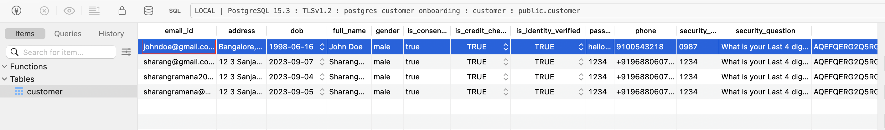
    </div>

    You should also see an entry in the `customer_enriched` table that holds the customer data with credit_score
    <div align="center"> 
        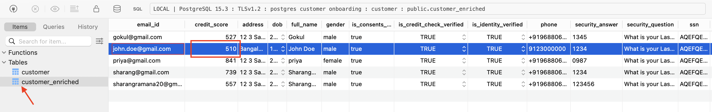
    </div>

6. **Login:**  
    Proceed to the login page in the UI. Enter the customer's email and password, then click the `Login` button to successfully log in.
    <div align="center"> 
        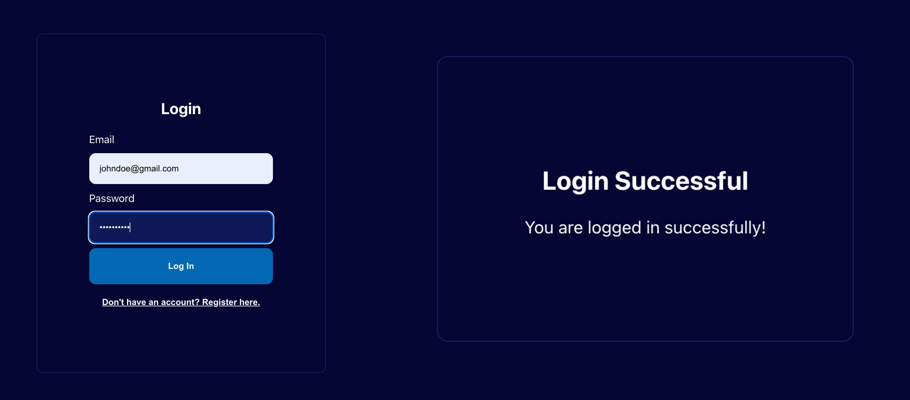
    </div>

# Confluent Cloud Stream Governance

Confluent offers data governance tools such as Stream Quality, Stream Catalog, and Stream Lineage in a package called Stream Governance. These features ensure your data is high quality, observable and discoverable. Learn more about **Stream Governance** [here](https://www.confluent.io/product/stream-governance/) and refer to the [docs](https://docs.confluent.io/cloud/current/stream-governance/overview.html) page for detailed information.

1.  Visit https://confluent.cloud and access your environment and cluster.
2.  Use the left hand-side menu and click on **Stream Lineage**.
    Stream lineage provides a graphical UI of the end to end flow of your data. Both from the a bird’s eye view and drill-down magnification for answering questions like:

    - Where did data come from?
    - Where is it going?
    - Where, when, and how was it transformed?

3. In our specific scenario, the stream lineage is depicted as follows: We employ a Java producer to produce records, which are then dispatched to three distinct topics: events, customer, and credit_score. On the customer and credit_score topics, we construct KSQLDB tables and amalgamate the information to construct an enriched table. Subsequently, both this customer and enriched data is transferred to the Postgres Sink Connector.

    <div align="center">
    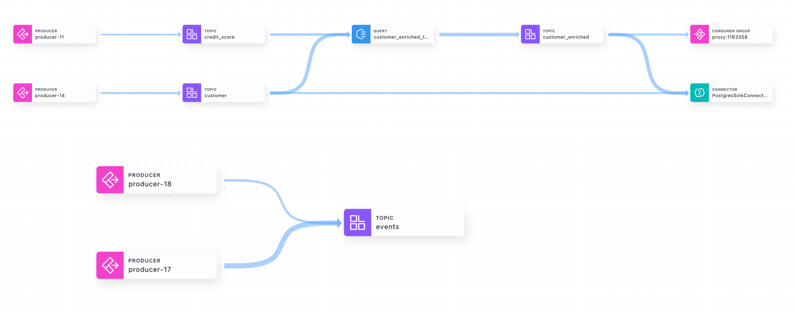
    </div>

# Teardown

If you wish to remove all resources created during the demo to avoid additional charges, run the following command to execute a cleanup:
   ```bash
   terraform destroy
   ```
This will delete all resources provisioned by Terraform.

# References
1. Confluent Cloud cluster types [page](https://docs.confluent.io/cloud/current/clusters/cluster-types.html)
2. ksqlDB [page](https://www.confluent.io/product/ksqldb/) and [use cases](https://developer.confluent.io/tutorials/#explore-top-use-cases)
3. Stream Governance [page](https://www.confluent.io/product/stream-governance/) and [doc](https://docs.confluent.io/cloud/current/stream-governance/overview.html)
4. RBAC in Confluent Cloud [page](https://docs.confluent.io/cloud/current/access-management/access-control/rbac/overview.html)
5. Terraform provider for Confluent [page](https://registry.terraform.io/providers/confluentinc/confluent/latest/docs)
