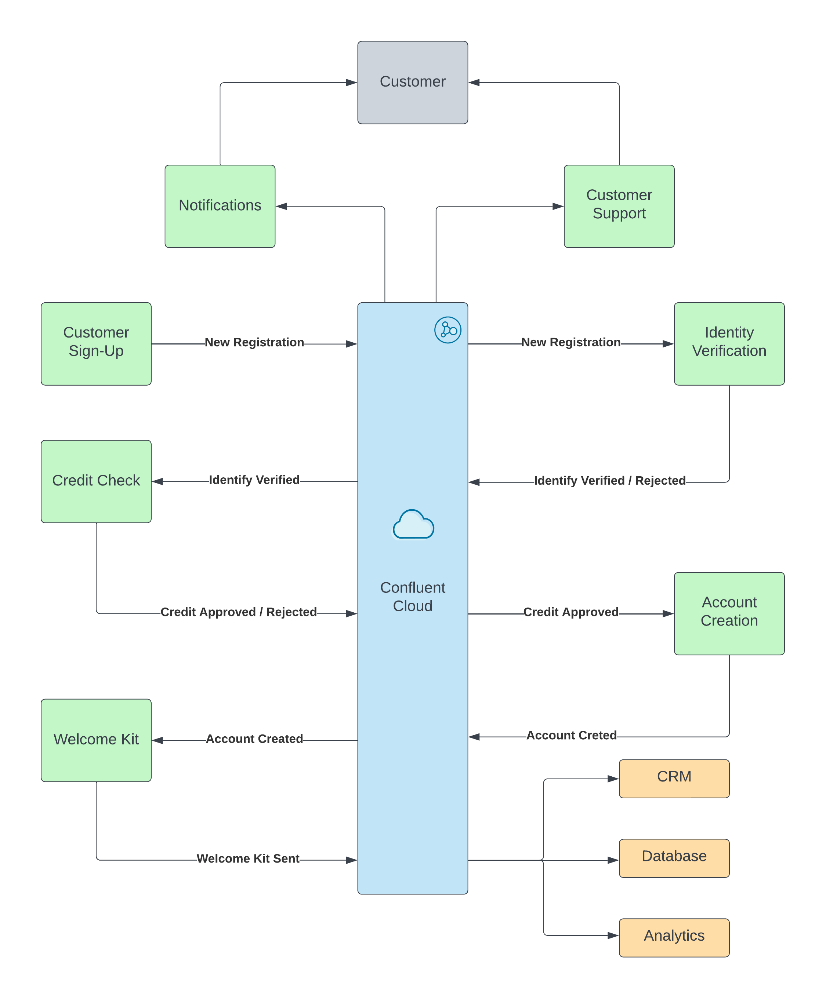
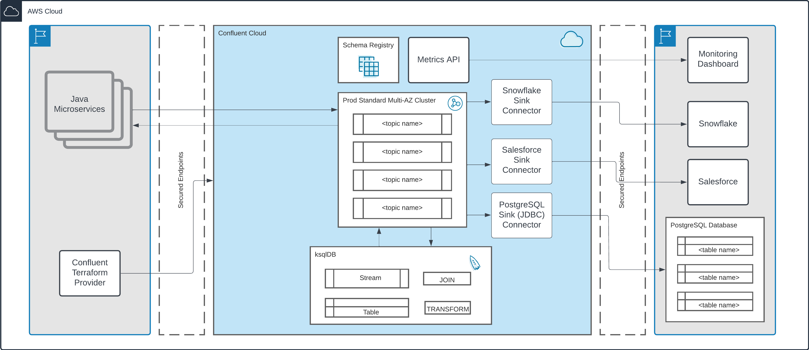
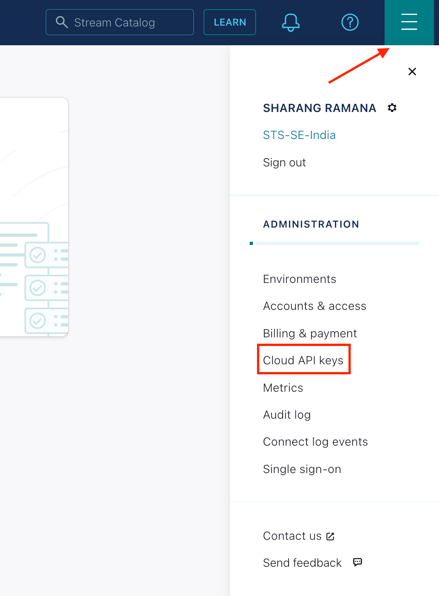
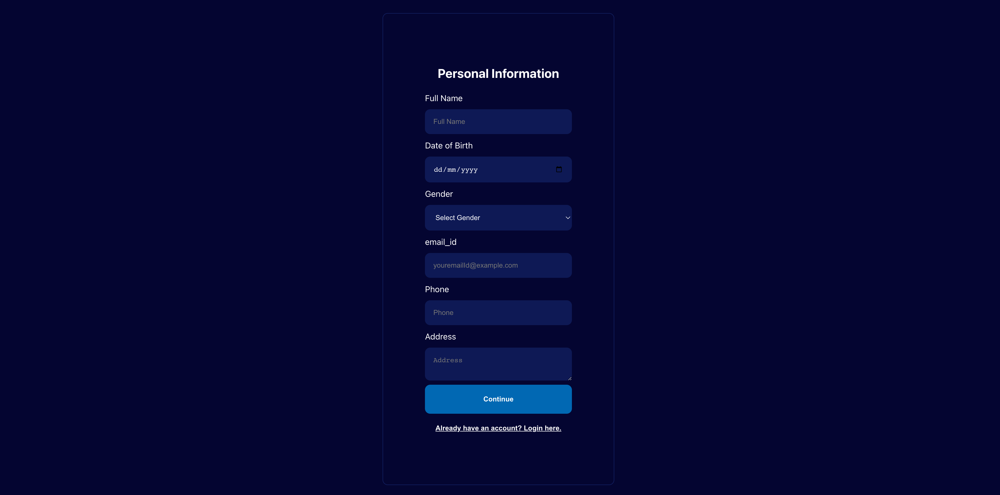

# Supercharge Customer Onboarding with Event-Driven Microservices and Confluent Cloud
In today's fast-paced digital landscape, organizations from various industries are harnessing technology to deliver exceptional customer experiences. Among the critical touchpoints in this journey, the 'Customer Onboarding' process stands out. Often viewed as time-consuming and complex, customer onboarding represents a prime opportunity for digital transformation. This demonstration showcases the advantages of leveraging Confluent Cloud for customer onboarding and offers insights into how it empowers businesses to accomplish their objectives.

# Overview
This demo illustrates the data ingestion process during user signup and the subsequent production of user details and events into Confluent Cloud topics. All user information collected in these topics is synchronized with the Postgres database via a connector. The primary objective is to capture user details and facilitate account creation and login actions using Kafka-based event-driven microservices.

# Architecture Diagram

At the core of the modernized customer onboarding system for financial services organizations lies Confluent Cloud, enabling real-time event streaming and processing. This dynamic infrastructure relies on Kafka as its backbone, seamlessly connecting a suite of specialized microservices. Below is an overview of their orchestrated workflow:

<div align="center"> 
  
</div>

The streaming architecture, powered by Confluent Cloud, offers an agile, responsive, and customer-centric onboarding process. With Kafka as the central component, each microservice operates independently yet stays seamlessly synchronized, highlighting the capabilities of event-driven architectures.

<div align="center"> 
  
</div>

In this demonstration, we will explore the signup and login flows, utilizing React (frontend) and Java (backend) to interactively generate records and events. User and event details will be collected in dedicated topics, and the Postgres sink connector in Confluent Cloud will be employed to transfer the data into the database. Subsequently, when the login action is initiated, the user data will be retrieved to verify the account login.

> **Note:** Please note that this application is designed for interactive demo purposes and to illustrate real-world customer scenarios. It is not intended for production use.

# Prerequisites

To ensure a smooth and successful experience with this demo, please make sure you have the following tools and accounts set up:

- **Confluent Cloud Account**: You'll need a Confluent Cloud account. If you don't have one, you can sign up for a free trial [here](https://developer.hashicorp.com/terraform/tutorials/aws-get-started/install-cli).
    - After verifying your email address, access Confluent Cloud sign-in by navigating [here](https://confluent.cloud).
    - When provided with the _username_ and _password_ prompts, fill in your credentials.
    
    > **Note:** If you're logging in for the first time you will see a wizard that will walk you through the some tutorials. Minimize this as you will walk through these steps in this guide.

    - Create Confluent Cloud API keys by following the steps in UI.Click on the button that is present on the right top section and click on Cloud API Key.
    <div align="center"> 
        
    </div>

    - Now Click Add Key to generate API keys and store it as we will be using that key in this demo.
    > **Note:** This is different than Kafka cluster API keys. 

- **Terraform**: If you don't already have Terraform installed, you can find installation instructions [here](https://developer.hashicorp.com/terraform/tutorials/aws-get-started/install-cli).

- **Node.js**: You'll need Node.js installed on your system. You can download it from the official website [here](https://nodejs.org/en/download), or use your [system's package manager](https://nodejs.org/en/download/package-manager).

- **Java 17**: Ensure you have Java 17 installed. You can follow the installation instructions [here](https://www.oracle.com/in/java/technologies/downloads/#java17).

- **Postgres Database**: You'll need a Postgres database instance. You can provision one via [via aws](https://aws.amazon.com/getting-started/hands-on/create-connect-postgresql-db/), [via docker](https://www.commandprompt.com/education/how-to-create-a-postgresql-database-in-docker/), or any other method of your choice. Make sure it is accessible to Confluent Cloud and the Java client.

With these prerequisites in place, you'll be ready to explore and run the demo seamlessly.
  
# Setup
1. Clone the repository
    ```
    git clone https://github.com/sharang-ramana/Customer-Onboarding.git
    ```
2. This demo uses Terraform  to spin up resources that are needed.
    - Update the `terraform/variables.tf` file for the following variables with your Cloud API credentials.
        ```
            variable "confluent_cloud_api_key" {
            
            default = " Replace with your API Key created during pre-requsite"   
            }

            variable "confluent_cloud_api_secret" {
            default = "Replace with your API Key created during pre-requsite"   
            }
        ```
    ### Build your cloud infrastructure

    - Navigate to the repo's terraform directory.
        ```bash
        cd terraform
        ```

    - Initialize Terraform within the directory.
        ```
        terraform init
        ```

    - Preview the actions Terraform would take to modify your infrastructure or Check if there are any errors in the code.
        ```
        terraform plan
        ```

    - Apply the plan to create the infrastructure.

        ```
        terraform apply 
        ```

    - Get the credentials and other info which were automatically created by the terraform script, which will also be used later in this demo.
        ```
        terraform output resource-ids
        ```

    - Verify the Environment, Cluster, Schema Registry, Topics and Connector created in the Confluent Cloud UI by terraform.

   > **Note:** Read the `main.tf` configuration file [to see what will be created](./terraform/main.tf).

3. Run the React application
    ```bash
    cd Frontend
    npm install
    npm start
    ```
    Now the site should be live [here](http://localhost:3000/)

4. Run the Java Backend
    - Add the postgres credentials to the **application.properties** present in this path `Backend/src/main/resources/`
    - Add the Kafka and Schema Registry credentials created via `terraform output resource-ids` to the **client.properties** present in `Backend/src/main/resources/`
    - Run the below commands
        ```bash
        cd Backend
        mvn spring-boot:run
        ```
        Now the Backend should be exposed via `8080` port `http://localhost:8080/` and also the `customer` table will be created in the postgres database with necessary columns.

# Demo

1. **Signup Process:**
    Open your web browser and go to `http://localhost:3000/`. This will take you to the signup screen.
    <div align="center"> 
        
    </div>
    Fill in the required details on each screen and proceed until you reach the final step, where you'll see the message `Your account is created successfully!`

2. **Event Tracking:**
    At each step of the signup form, take note that an event is produced to the `events` topic in Confluent Cloud. The record key for each event is your email ID, which you entered on the signup page.

3. **Customer Data Recording:**
    On the final step of the signup process, you'll notice that a record containing the user details you entered is added to the `customer` topic in Confluent Cloud. Once again, the record key is your email ID.

4. **Database Entry:**
    Check the Postgres sink connector created as part of the Terraform setup. It retrieves data from the customer topic and inserts it into the customer table. You should now see an entry in the customer table that matches the details you provided on the UI.

5. **Login:**
    Proceed to the login page in the UI. Enter the customer's email and password, then click the `Login` button to successfully log in.

# Teardown

If you wish to remove all resources created during the demo to avoid additional charges, run the following command to execute a cleanup:
   ```bash
   terraform destroy
   ```
This will delete all resources provisioned by Terraform.